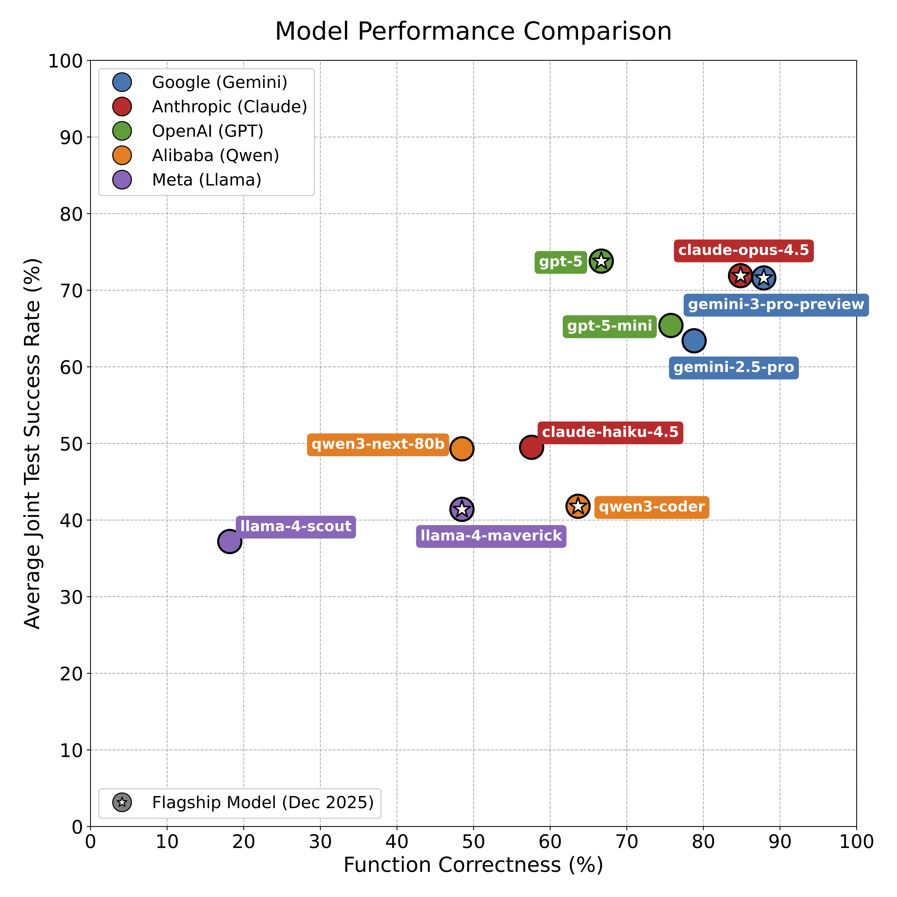

# FEM-bench

[](https://www.python.org/)
[](https://www.python.org/)
[](https://www.python.org/)

[](https://github.com/sandialabs/sibl#license)

[](https://codecov.io/gh/elejeune11/FEM-bench)
[](https://github.com/elejeune11/FEM-bench/actions)

[](https://doi.org/10.5281/zenodo.16732264)

A comprehensive benchmarking system for evaluating Large Language Models (LLMs) on finite element method (FEM) tasks.

**NOTE: this is a work in progress, new tasks and results will be posted as they are created. If you have questions or comments, please feel free to contact me at [elejeune@bu.edu](mailto:elejeune@bu.edu)!**

## Table of Contents

* [Overview](#overview)
    - [File Structure](#files)
* [FEM-Bench Setup Instructions](#setup)
* [Reproducing Our Results](#repro)
    - [Latest Results](#results)
    - [How To Run the Pipeline](#run_pipeline)
    - [User-Facing Pipeline API](#pipeline_api)
* [Extending to Additional LLMs](#other_llms)
* [Creating New Tasks](#new_tasks)
    - [From Task to LLM Prompt](#task_to_llm)
* [Citation Info](#cite)
* [TODO List](#todo)


## Overview <a name="overview"></a>

FEM-bench evaluates LLMs through a dual-task approach:
* **Implementation tasks**: Generate correct finite element functions (shape functions, numerical integration, etc.)
* **Test generation**: Write comprehensive pytest tests that validate mathematical properties (partition of unity, interpolation conditions, etc.)

You can think of FEM-Bench as having three parts:
* **The core software**: This contains all logic for loading tasks, generating prompts, evaluating function correctness, and computing benchmark metrics. It is designed to be model-agnostic, reproducible, and modular, enabling consistent evaluation regardless of the LLM used.

* **The LLM API evaluation**: API clients for models like GPT-4, Deepseek, Claude, and Gemini are isolated in a separate module to support easy extension, cleaner testing, and secure handling of API keys. This separation ensures that model-specific logic doesn’t pollute the core benchmarking pipeline and allows offline re-evaluation using saved outputs.

* **Tasks**: Each task defines a reference implementation, test cases, and metadata for both code and test generation. These form the basis for evaluating LLM performance on well-defined FEM-related coding challenges.

A schematic of the FEM-Bench workflow is shown here:


**A major goal of this tool is to make it easy to create and deploy new Tasks, ensuring the system stays relevant and highly extensible.**

### File Structure <a name="files"></a>

```
fem-bench/
├── .env                       # API keys for LLM access
├── fem_bench_env/             # Virtual environment
├── LICENSE                    # License file
├── llm_api/                   # API client wrappers for LLMs
├── llm_outputs/               # LLM responses
├── prompt_templates/          # Jinja2 templates for prompts
├── prompts/                   # Generated prompts
├── pyproject.toml             # Project metadata and dependencies
├── README.md                  # Project README
├── results/                   # Evaluation results
├── run_pipeline.py            # Script to run the full benchmarking pipeline
├── src/
│   └── fem_bench/
│       ├── __init__.py
│       ├── evaluate_output.py     # Evaluation logic
│       ├── pipeline_utils.py      # Pipeline orchestration
│       ├── task_base.py           # Core task definitions
│       ├── task_loader.py         # Task loading utilities
│       ├── task_to_prompt.py      # Prompt generation
│       └── fem_bench.egg-info/    # Metadata for installed package
├── task_template.py          # Template for defining new tasks
├── tasks/                    # Task definitions
└── tests/                    # Test suite

```

## FEM-Bench Setup Instructions <a name="setup"></a>

### Prerequisites
- Python 3.10+ (3.11 and 3.12 should work, 3.10 has been tested most extensively)

### Installation

1. **Clone and setup:**
   ```bash
   git clone https://github.com/elejeune11/FEM-bench
   cd fem-bench
   
   # Create virtual environment
   python3.10 -m venv fem_bench_env
   source fem_bench_env/bin/activate  # Linux/Mac
   # fem_bench_env\Scripts\activate   # Windows
   
   # Install package
   pip install --upgrade pip
   pip install -e ".[dev]"
   
   # Install required packages for LLM API clients
   pip install -r requirements.txt
   ```

2. **Verify installation:**
   ```bash
   python -c "import fem_bench; print('FEM-Bench installed successfully')"
   pytest --cov=fem_bench --cov-report=term-missing -v tests/
   ```

**Deactivating Environment**

```bash
deactivate
rm -rf fem_bench_env  # To completely remove
```

## Reproducing Our Results <a name="repro"></a>

### Latest Results <a name="results"></a>

### Output Metrics:
* **Function Correctness (✓ = Match)**: Indicates whether each model's generated function produced outputs that exactly matched the reference implementation on all verification inputs.
* **Joint Test Success Rate (%)**: Shows the percentage of model-generated test functions that both (1) passed on the reference implementation and (2) failed on all known-broken implementations. This metric captures tests that successfully distinguish correct from incorrect solutions. *(Note: this does not guarantee comprehensive coverage — only a curated set of failure cases are tested.)*

### Function Correctness (✓ = Match) - First Run

| Task                                                      | gemini-3-pro-preview   | gemini-2.5-pro   | claude-opus-4.5   | claude-haiku-4.5   | gpt-5   | gpt-5-mini   | qwen3-coder   | qwen3-next-80b   | llama-4-maverick   | llama-4-scout   |
|:----------------------------------------------------------|:-----------------------|:-----------------|:------------------|:-------------------|:--------|:-------------|:--------------|:-----------------|:-------------------|:----------------|
| **FEM 1D** | | | |
| linear_elastic_CC0_H0_T0                           | ✓                      | ✓                | ✓                 | ×                  | ✓       | ✓            | ✓             | ✓                | ✓                  | ×               |
| local_elastic_stiffness_CC0_H3_T1                  | ✓                      | ✓                | ✓                 | ×                  | ×       | ×            | ✓             | ×                | ×                  | ✓               |
| uniform_mesh_CC0_H0_T0                             | ✓                      | ✓                | ✓                 | ✓                  | ×       | ✓            | ✓             | ✓                | ✓                  | ✓               |
| **FEM 2D** | | | |
| quad8_element_distributed_load_CC0_H0_T0           | ✓                      | ✓                | ✓                 | ✓                  | ✓       | ✓            | ✓             | ×                | ×                  | ×               |
| quad8_integral_of_derivative_CC0_H3_T3             | ✓                      | ✓                | ×                 | ×                  | ×       | ✓            | ×             | ✓                | ×                  | ×               |
| quad8_mesh_rectangle_CC0_H0_T0                     | ✓                      | ✓                | ✓                 | ✓                  | ✓       | ✓            | ✓             | ✓                | ×                  | ×               |
| quad8_physical_gradient_CC0_H1_T3                  | ✓                      | ✓                | ×                 | ×                  | ✓       | ✓            | ×             | ×                | ×                  | ×               |
| quad8_shape_fcns_and_derivatives_CC0_H0_T0         | ✓                      | ✓                | ✓                 | ×                  | ✓       | ✓            | ×             | ×                | ×                  | ×               |
| quad_quadrature_CC0_H0_T0                          | ✓                      | ✓                | ✓                 | ✓                  | ✓       | ✓            | ✓             | ✓                | ✓                  | ×               |
| tri6_mesh_rectangle_CC0_H0_T0                      | ✓                      | ✓                | ✓                 | ✓                  | ✓       | ✓            | ✓             | ×                | ×                  | ×               |
| tri6_shape_fcns_and_derivatives_CC0_H0_T0          | ✓                      | ✓                | ✓                 | ✓                  | ✓       | ✓            | ✓             | ×                | ✓                  | ×               |
| tri_quadrature_CC0_H0_T0                           | ✓                      | ✓                | ✓                 | ✓                  | ✓       | ✓            | ✓             | ✓                | ✓                  | ✓               |
| **MSA 3D** | | | |
| assemble_global_geometric_stiffness_CC1_H4_T1      | ✓                      | ✓                | ✓                 | ✓                  | ✓       | ✓            | ✓             | ✓                | ✓                  | ✓               |
| assemble_global_geometric_stiffness_CC1_H4_T2      | ×                      | ×                | ✓                 | ×                  | ×       | ×            | ×             | ×                | ×                  | ×               |
| assemble_global_geometric_stiffness_CC1_H4_T3      | ×                      | ×                | ×                 | ×                  | ×       | ×            | ×             | ×                | ×                  | ×               |
| assemble_global_linear_elastic_stiffness_CC0_H2_T1 | ✓                      | ✓                | ✓                 | ✓                  | ✓       | ✓            | ✓             | ✓                | ✓                  | ×               |
| assemble_global_linear_elastic_stiffness_CC0_H2_T3 | ✓                      | ×                | ✓                 | ×                  | ✓       | ×            | ×             | ×                | ×                  | ×               |
| assemble_global_load_CC0_H0_T0                     | ✓                      | ✓                | ✓                 | ✓                  | ✓       | ✓            | ✓             | ✓                | ✓                  | ×               |
| elastic_critical_load_CC1_H10_T1                   | ✓                      | ✓                | ✓                 | ✓                  | ✓       | ✓            | ✓             | ✓                | ✓                  | ×               |
| elastic_critical_load_CC1_H10_T2                   | ✓                      | ×                | ✓                 | ×                  | ×       | ×            | ×             | ×                | ×                  | ×               |
| elastic_critical_load_CC1_H10_T3                   | ×                      | ×                | ×                 | ×                  | ×       | ×            | ×             | ×                | ×                  | ×               |
| linear_elastic_CC0_H6_T1                           | ✓                      | ✓                | ✓                 | ✓                  | ✓       | ✓            | ✓             | ✓                | ✓                  | ✓               |
| linear_elastic_CC0_H6_T3                           | ✓                      | ✓                | ✓                 | ×                  | ×       | ✓            | ×             | ×                | ×                  | ×               |
| local_elastic_stiffness_CC0_H0_T0                  | ✓                      | ✓                | ✓                 | ✓                  | ×       | ×            | ✓             | ×                | ✓                  | ×               |
| local_element_loads_CC0_H2_T1                      | ✓                      | ✓                | ✓                 | ✓                  | ✓       | ✓            | ✓             | ✓                | ✓                  | ×               |
| local_element_loads_CC0_H2_T3                      | ✓                      | ✓                | ✓                 | ×                  | ✓       | ✓            | ×             | ×                | ×                  | ×               |
| local_geometric_stiffness_CC1_H0_T0                | ×                      | ×                | ×                 | ×                  | ×       | ×            | ×             | ×                | ×                  | ×               |
| partition_DOFs_CC0_H0_T0                           | ✓                      | ✓                | ✓                 | ✓                  | ✓       | ✓            | ✓             | ✓                | ✓                  | ×               |
| solve_eigenvalue_CC1_H1_T1                         | ✓                      | ✓                | ✓                 | ×                  | ✓       | ✓            | ✓             | ×                | ✓                  | ×               |
| solve_eigenvalue_CC1_H1_T3                         | ✓                      | ✓                | ✓                 | ✓                  | ✓       | ✓            | ✓             | ✓                | ✓                  | ×               |
| solve_linear_CC0_H1_T1                             | ✓                      | ✓                | ✓                 | ✓                  | ✓       | ✓            | ✓             | ×                | ×                  | ×               |
| solve_linear_CC0_H1_T3                             | ✓                      | ✓                | ✓                 | ✓                  | ✓       | ✓            | ✓             | ✓                | ✓                  | ✓               |
| transformation_matrix_CC0_H0_T0                    | ✓                      | ×                | ✓                 | ✓                  | ×       | ✓            | ×             | ✓                | ×                  | ×               |
| Total                                                     | 29/33                  | 26/33            | 28/33             | 19/33              | 22/33   | 25/33        | 21/33         | 16/33            | 16/33              | 6/33            |

### Joint Test Success Rate (%) - First Run

| Task                                                      | gemini-3-pro-preview   | gemini-2.5-pro   | claude-opus-4.5   | claude-haiku-4.5   | gpt-5   | gpt-5-mini   | qwen3-coder   | qwen3-next-80b   | llama-4-maverick   | llama-4-scout   |
|:----------------------------------------------------------|:-----------------------|:-----------------|:------------------|:-------------------|:--------|:-------------|:--------------|:-----------------|:-------------------|:----------------|
| **FEM 1D** | | | |
| linear_elastic_CC0_H0_T0                           | 100.0%                 | 100.0%           | 100.0%            | 100.0%             | 100.0%  | 100.0%       | 50.0%         | 50.0%            | –                  | 100.0%          |
| local_elastic_stiffness_CC0_H3_T1                  | 100.0%                 | 100.0%           | 100.0%            | 100.0%             | 0.0%    | 100.0%       | 100.0%        | 100.0%           | 100.0%             | 100.0%          |
| uniform_mesh_CC0_H0_T0                             | 100.0%                 | 100.0%           | 100.0%            | 100.0%             | 100.0%  | 100.0%       | 100.0%        | 100.0%           | 100.0%             | 100.0%          |
| **FEM 2D** | | | |
| quad8_element_distributed_load_CC0_H0_T0           | 100.0%                 | 100.0%           | 100.0%            | 100.0%             | 100.0%  | 50.0%        | 50.0%         | 50.0%            | 0.0%               | 0.0%            |
| quad8_integral_of_derivative_CC0_H3_T3             | 66.7%                  | 66.7%            | 100.0%            | 33.3%              | 100.0%  | 33.3%        | 0.0%          | 66.7%            | 33.3%              | 0.0%            |
| quad8_mesh_rectangle_CC0_H0_T0                     | 100.0%                 | 66.7%            | 66.7%             | 66.7%              | 100.0%  | 66.7%        | 66.7%         | 66.7%            | 66.7%              | 33.3%           |
| quad8_physical_gradient_CC0_H1_T3                  | 100.0%                 | 100.0%           | 100.0%            | 100.0%             | 100.0%  | 100.0%       | 50.0%         | 100.0%           | 100.0%             | 50.0%           |
| quad8_shape_fcns_and_derivatives_CC0_H0_T0         | 100.0%                 | 83.3%            | 100.0%            | 100.0%             | 100.0%  | 100.0%       | 83.3%         | 83.3%            | 83.3%              | 50.0%           |
| quad_quadrature_CC0_H0_T0                          | 40.0%                  | 100.0%           | 100.0%            | 100.0%             | 100.0%  | 100.0%       | 100.0%        | 60.0%            | 60.0%              | 100.0%          |
| tri6_mesh_rectangle_CC0_H0_T0                      | 66.7%                  | 100.0%           | 100.0%            | 100.0%             | 100.0%  | 100.0%       | 100.0%        | 66.7%            | 100.0%             | 66.7%           |
| tri6_shape_fcns_and_derivatives_CC0_H0_T0          | 100.0%                 | 100.0%           | 100.0%            | 50.0%              | 83.3%   | 100.0%       | 50.0%         | 50.0%            | 50.0%              | 33.3%           |
| tri_quadrature_CC0_H0_T0                           | 40.0%                  | 40.0%            | 40.0%             | 100.0%             | 60.0%   | 100.0%       | 100.0%        | 100.0%           | 60.0%              | 60.0%           |
| **MSA 3D** | | | |
| assemble_global_geometric_stiffness_CC1_H4_T1      | 0.0%                   | 50.0%            | 0.0%              | 0.0%               | 100.0%  | 0.0%         | 50.0%         | 50.0%            | 0.0%               | 0.0%            |
| assemble_global_geometric_stiffness_CC1_H4_T2      | 0.0%                   | 0.0%             | 0.0%              | 0.0%               | 0.0%    | 0.0%         | 0.0%          | 0.0%             | 0.0%               | –               |
| assemble_global_geometric_stiffness_CC1_H4_T3      | 0.0%                   | 0.0%             | –                 | 0.0%               | 0.0%    | 0.0%         | 0.0%          | 0.0%             | 0.0%               | 0.0%            |
| assemble_global_linear_elastic_stiffness_CC0_H2_T1 | 100.0%                 | 100.0%           | 100.0%            | 0.0%               | 100.0%  | 100.0%       | 100.0%        | 100.0%           | 0.0%               | 0.0%            |
| assemble_global_linear_elastic_stiffness_CC0_H2_T3 | 100.0%                 | 100.0%           | 0.0%              | 0.0%               | 100.0%  | 100.0%       | 0.0%          | 100.0%           | 0.0%               | 0.0%            |
| assemble_global_load_CC0_H0_T0                     | 100.0%                 | –                | 100.0%            | 100.0%             | 100.0%  | 100.0%       | 100.0%        | 100.0%           | 100.0%             | 100.0%          |
| elastic_critical_load_CC1_H10_T1                   | 0.0%                   | 0.0%             | 0.0%              | 0.0%               | 0.0%    | 0.0%         | 0.0%          | –                | 0.0%               | 0.0%            |
| elastic_critical_load_CC1_H10_T2                   | 0.0%                   | 0.0%             | 0.0%              | 0.0%               | 0.0%    | 0.0%         | 0.0%          | –                | 0.0%               | 0.0%            |
| elastic_critical_load_CC1_H10_T3                   | 0.0%                   | 0.0%             | 0.0%              | 0.0%               | 0.0%    | 0.0%         | 0.0%          | –                | 0.0%               | 0.0%            |
| linear_elastic_CC0_H6_T1                           | 100.0%                 | 100.0%           | 100.0%            | 50.0%              | 100.0%  | 50.0%        | 0.0%          | 0.0%             | 0.0%               | 0.0%            |
| linear_elastic_CC0_H6_T3                           | 100.0%                 | 50.0%            | 100.0%            | 50.0%              | 100.0%  | 100.0%       | 0.0%          | 0.0%             | 0.0%               | 0.0%            |
| local_elastic_stiffness_CC0_H0_T0                  | 50.0%                  | –                | 100.0%            | 0.0%               | 100.0%  | –            | 0.0%          | 0.0%             | –                  | 0.0%            |
| local_element_loads_CC0_H2_T1                      | 100.0%                 | 50.0%            | 100.0%            | 0.0%               | 50.0%   | 75.0%        | 0.0%          | 50.0%            | 75.0%              | 75.0%           |
| local_element_loads_CC0_H2_T3                      | 100.0%                 | 100.0%           | 100.0%            | 0.0%               | 75.0%   | 100.0%       | 0.0%          | 50.0%            | 75.0%              | 75.0%           |
| local_geometric_stiffness_CC1_H0_T0                | 50.0%                  | –                | 50.0%             | 50.0%              | 50.0%   | 0.0%         | 50.0%         | 50.0%            | 0.0%               | 0.0%            |
| partition_DOFs_CC0_H0_T0                           | 100.0%                 | 100.0%           | 100.0%            | 100.0%             | 100.0%  | 100.0%       | 100.0%        | 0.0%             | 100.0%             | 0.0%            |
| solve_eigenvalue_CC1_H1_T1                         | 100.0%                 | 40.0%            | 100.0%            | 0.0%               | 100.0%  | 100.0%       | 20.0%         | 100.0%           | 100.0%             | 100.0%          |
| solve_eigenvalue_CC1_H1_T3                         | 100.0%                 | 80.0%            | 100.0%            | 100.0%             | 100.0%  | 100.0%       | 60.0%         | 100.0%           | 80.0%              | 100.0%          |
| solve_linear_CC0_H1_T1                             | 50.0%                  | 100.0%           | 50.0%             | 0.0%               | 50.0%   | 50.0%        | 0.0%          | 0.0%             | 50.0%              | 50.0%           |
| solve_linear_CC0_H1_T3                             | 100.0%                 | 100.0%           | 100.0%            | 100.0%             | 100.0%  | 100.0%       | 50.0%         | 0.0%             | 0.0%               | 0.0%            |
| transformation_matrix_CC0_H0_T0                    | 100.0%                 | 66.7%            | 66.7%             | 33.3%              | 66.7%   | 33.3%        | 0.0%          | 33.3%            | 33.3%              | 33.3%           |
| Avg Joint Success %                                       | 71.6%                  | 63.4%            | 71.9%             | 49.5%              | 73.8%   | 65.4%        | 41.8%         | 49.3%            | 41.4%              | 37.2%           |

### Task-by-task Pass@5 - Sorted "Easiest" to "Hardest"

| Task | Gemini 3 Pro (Preview) | Claude Opus 4.5 | GPT 5 |
|------|------------------------|-----------------|-------|
| **FEM 1D** | | | |
| 🟩 linear elastic (T0) | 5/5 | 5/5 | 5/5 |
| 🟡 uniform mesh (T0) | 5/5 | 4/5 | 0/5 |
| 🟡 local elastic stiffness (T1) | 2/5 | 5/5 | 0/5 |
| **FEM 2D** | | | |
| 🟩 tri quadrature (T0) | 5/5 | 5/5 | 5/5 |
| 🟩 tri6 mesh rectangle (T0) | 5/5 | 5/5 | 5/5 |
| 🟩 tri6 shape fcns and derivatives (T0) | 5/5 | 5/5 | 5/5 |
| 🟩 quad quadrature (T0) | 5/5 | 4/5 | 5/5 |
| 🟩 quad8 element distributed load (T0) | 5/5 | 4/5 | 5/5 |
| 🟩 quad8 mesh rectangle (T0) | 5/5 | 4/5 | 5/5 |
| 🟩 quad8 shape fcns and derivatives (T0) | 5/5 | 4/5 | 5/5 |
| 🟡 quad8 integral of derivative (T3) | 4/5 | 2/5 | 4/5 |
| 🟡 quad8 physical gradient (T3) | 5/5 | 0/5 | 3/5 |
| **MSA 3D** | | | |
| 🟩 assemble global geometric stiffness (T1) | 5/5 | 5/5 | 5/5 |
| 🟩 assemble global linear elastic stiffness (T1) | 5/5 | 5/5 | 5/5 |
| 🟩 assemble global load (T0) | 5/5 | 5/5 | 5/5 |
| 🟩 elastic critical load (T1) | 5/5 | 5/5 | 5/5 |
| 🟩 linear elastic (T1) | 5/5 | 5/5 | 5/5 |
| 🟩 local element loads (T3) | 5/5 | 5/5 | 5/5 |
| 🟩 solve eigenvalue (T1) | 5/5 | 5/5 | 5/5 |
| 🟩 assemble global linear elastic stiffness (T3) | 5/5 | 5/5 | 4/5 |
| 🟩 local element loads (T1) | 5/5 | 5/5 | 4/5 |
| 🟩 partition DOFs (T0) | 5/5 | 4/5 | 5/5 |
| 🟩 solve eigenvalue (T3) | 5/5 | 4/5 | 5/5 |
| 🟩 solve linear (T1) | 5/5 | 4/5 | 5/5 |
| 🟩 solve linear (T3) | 5/5 | 3/5 | 5/5 |
| 🟡 assemble global geometric stiffness (T2) | 4/5 | 5/5 | 3/5 |
| 🟡 linear elastic (T3) | 5/5 | 4/5 | 3/5 |
| 🟡 local elastic stiffness (T0) | 5/5 | 4/5 | 3/5 |
| 🟡 transformation matrix (T0) | 5/5 | 5/5 | 2/5 |
| 🟡 elastic critical load (T2) | 4/5 | 4/5 | 2/5 |
| ❌ assemble global geometric stiffness (T3) | 0/5 | 0/5 | 0/5 |
| ❌ elastic critical load (T3) | 0/5 | 0/5 | 0/5 |
| ❌ local geometric stiffness (T0) | 0/5 | 0/5 | 0/5 |
| | | | |
| **Tasks Solved (any success)** | **30/33** | **29/33** | **28/33** |
| **Tasks Solved (5/5 success)** | **26/33** | **16/33** | **19/33** |

The figure below summarizes the results presented in the tables above in a graph that plots the function correctness against the average joint test success rate for all evaluated models. This visualization highlights the performance differences across model families and identifies the current state-of-the-art on the FEM-Bench benchmark.




### How To Run the Pipeline <a name="run_pipeline"></a>

To use the LLM APIs, you must create a `.env` file at the root of your project with your own API keys:

```bash
OPENAI_API_KEY=your_openai_key_here
GEMINI_API_KEY=your_google_gemini_key_here
CLAUDE_API_KEY=your_anthropic_key_here
TOGETHER_API_KEY=your_together_ai_key_here
```

These keys are **not included** in the repo for security. Each client loads the appropriate key using `dotenv`. Missing keys will raise a clear error during runtime. The current code supports ten models: gemini-3-pro-preview, gemini-2.5-pro, claude-opus-4.5, claude-haiku-4.5, gpt-5, gpt-5-mini, qwen3-coder, qwen3-next-80b, llama-4-maverick, and llama-4-scout. You can modify the code to change this, and you only need to include keys for the models you plan to use.

The `run_pipeline.py` script automates a **full LLM benchmarking cycle**:
1. **Load tasks** from the `tasks/` directory.
2. **Generate prompts** for function and test synthesis, saved to `prompts/`.
3. **Call LLMs** to generate code and test files for each task:
   - Outputs are saved to `llm_outputs/`
   - Skips generation if outputs already exist
4. **Load generated completions** into the evaluation pipeline.
5. **Evaluate generated functions** against reference outputs.
6. **Evaluate generated test files** against correct and intentionally broken implementations.
7. **Aggregate results** and generate a Markdown summary in `results/`.

You can run the full benchmark directly with:

```bash
python run_pipeline.py
```

Outputs will be saved to:
- `llm_outputs/` for model completions
- `results/` for evaluation scores and `evaluation_summary.md`

### User-Facing Pipeline API <a name="pipeline_api"></a>

The table below summarizes all key methods available through the `FEMBenchPipeline` class. These are the only methods needed to run the full benchmark pipeline:

| Method | Purpose |
|--------|---------|
| `load_all_tasks()` | Load all tasks from the specified `tasks_dir` and populate the internal registry. |
| `generate_and_save_task_prompts()` | Create and save code-generation prompts (`*_code_prompt.txt`). |
| `generate_and_save_test_prompts()` | Create and save test-generation prompts (`*_test_prompt.txt`). |
| `load_all_llm_outputs(allowed_llms=None)` | Load LLM-generated Python outputs from the output directory. Supports optional LLM filtering. |
| `evaluate_all_llm_outputs()` | Evaluate each LLM-generated function against the task reference function and store match results. |
| `evaluate_all_llm_tests()` | Evaluate LLM-generated test functions by running them against both reference and intentionally incorrect implementations. |
| `compute_aggregate_score()` | Compute summary metrics for each LLM including correctness, test pass rate, and expected failure detection rate. |
| `create_markdown_summary(filename="evaluation_summary.md")` | Write a Markdown report of all results to `results_dir`. |


## Extending to Additional LLMs <a name="other_llms"></a>

This repo is designed with modularity in mind: all model-specific API logic is isolated in the `llm_api/` folder, keeping the core benchmarking pipeline clean and stable.

To change the models used in the benchmark, update the `MODEL_NAMES` list in your pipeline script (e.g., `["gpt-5", "gemini-3-pro-preview", ...]`).

To add a new model:
- Create a new `*_client.py` file in `llm_api/` that defines `call_<model>_for_code()` and `call_<model>_for_tests()`.
- Update `llm_clients.py` to route the new `model_name` string to your client functions.

This setup makes it easy to support new providers, customize request/response handling, and preserve a unified interface for generating both function and test completions.


## Creating New Tasks <a name="new_tasks"></a>

Each task defines a single finite element related computation, including a reference implementation, test cases, and known failure modes. Tasks are modular and self-contained, enabling evaluation of both function generation and test synthesis. Examples include mesh generation, element stiffness assembly, and complete problem solvers. Before creating a new task, we recommend looking at already created tasks as examples.

To create a new task, you can start by copying the template:

```bash
cp task_template.py tasks/my_new_task.py
```

Each task file contains:

- **A reference implementation**: The correct function to be learned or reproduced by the model.
- **Helper functions (optional)**: Dependencies used by the main function, such as shape functions or numerical integrators.
- **Reference verification inputs**: A list of example inputs used to evaluate output correctness.
- **Test functions**: Pytest-style tests designed to check correctness, robustness, and behavior.
- **Expected failure cases**: One or more incorrect implementations that the test functions should catch.
- **Metadata**: Information like task ID, author, creation date, and a short description.

All components are bundled together in a `task_info()` function that returns structured metadata.

### From Task to LLM Prompt <a name="task_to_llm"></a>

Each Task defines a Python function to implement and is automatically converted into two structured prompts: one for function generation, and one for test synthesis. The code-generation prompt includes the target function’s exact signature and docstring, plus any helper functions and import restrictions. The test-generation prompt presents the same function and lists all test functions to implement, along with their names and docstrings.

To add a new Task, you only need to define its metadata, reference implementation, and test cases — the system handles formatting and prompt generation automatically. However, keep in mind that the information included in the function docstring will make it into the prompt.

#### Example Tasks:

Very simple Task:
* [FEM_1D_linear_elastic_CC0_H0_T0.py](tasks/FEM_1D_linear_elastic_CC0_H0_T0.py)

Slightly more complicated Task:
* [FEM_1D_local_elastic_stiffness_CC0_H3_T1.py](tasks/FEM_1D_local_elastic_stiffness_CC0_H3_T1.py)

The most complicated Task with no helper funcion:
* [MSA_3D_elastic_critical_load_CC1_H10_T3.py](tasks/MSA_3D_elastic_critical_load_CC1_H10_T3.py)

#### Example Generated Code Prompts:
* [FEM_1D_linear_elastic_CC0_H0_T0_code_prompt.txt](prompts/FEM_1D_linear_elastic_CC0_H0_T0_code_prompt.txt)
* [FEM_1D_local_elastic_stiffness_CC0_H3_T1_code_prompt.txt](prompts/FEM_1D_local_elastic_stiffness_CC0_H3_T1_code_prompt.txt)
* [MSA_3D_elastic_critical_load_CC1_H10_T3_code_prompt.txt](prompts/MSA_3D_elastic_critical_load_CC1_H10_T3_code_prompt.txt)


#### Example Generated Test Prompts:
* [FEM_1D_linear_elastic_CC0_H0_T0_test_prompt.txt](prompts/FEM_1D_linear_elastic_CC0_H0_T0_test_prompt.txt)
* [FEM_1D_local_elastic_stiffness_CC0_H3_T1_test_prompt.txt](prompts/FEM_1D_local_elastic_stiffness_CC0_H3_T1_test_prompt.txt)
* [MSA_3D_elastic_critical_load_CC1_H10_T3_test_prompt.txt](prompts/MSA_3D_elastic_critical_load_CC1_H10_T3_test_prompt.txt)


## Citation Info <a name="cite"></a>

After we have more Tasks completed, we will prepare a manuscript on our results. For now, if you use our work please cite the Zenodo concept DOI:

```
@software{lejeune2025fem_bench,
  author = {Emma Lejeune},
  title = {FEM-Bench: A Comprehensive Benchmarking System for Evaluating Large Language Models on Finite Element Method Tasks},
  url = {https://zenodo.org/records/16732264},
  doi = {10.5281/zenodo.16732264},
  year = {2025},
  publisher = {Zenodo},
  note = {Software release (all versions)},
  keywords = {finite element method, large language models, benchmarking, machine learning}
}
```